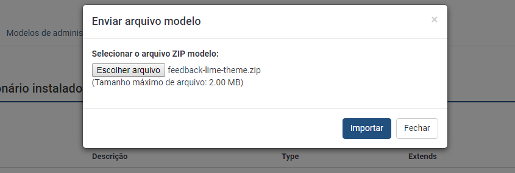
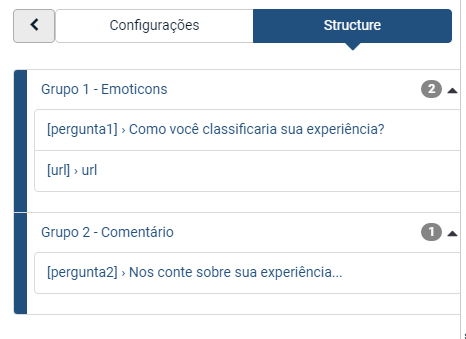
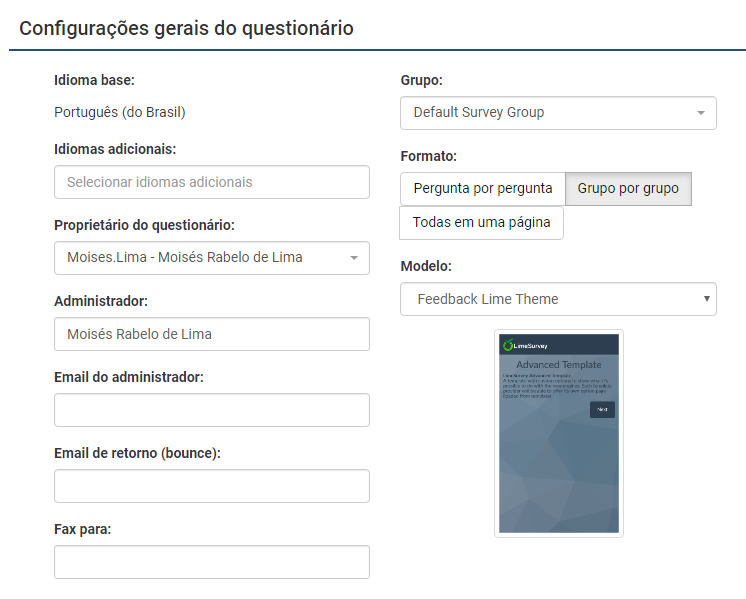
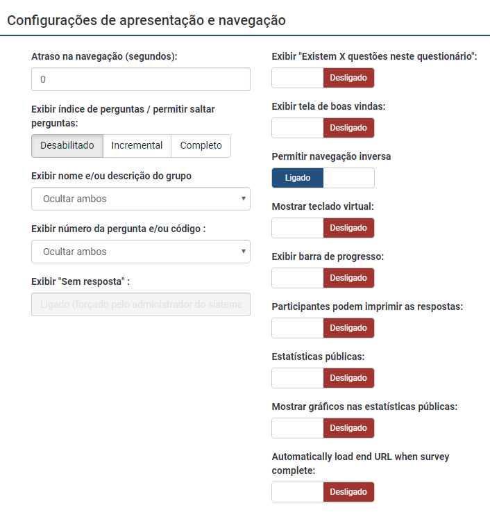

# Título do projeto

Happiness Feedback for Limesurvey

## Começando

Meu objetivo quando criei essa ferramenta, foi de criar algo simples que após instalado, pudesse ajudar os desenvolvedores a encontrar problemas de usabilidade e mais do que isso, descobrir o que fazem os usuários felizes. Sou desenvolvedor frontend e analista UX, Acredito de devemos parar de de adivinhar os que as pessoas estão sentido a respeito de uma funcionalidade e deixa-las nos contar por conta própria empoderando tanto os times de desenvolvimento quanto os usuários. 

Trata-se de um widget de captura emocional, com ele o usuário consegue deixar uma nota de 1 a 5 a mostrando seu nível de felicidade a respeito da experiência com uma página específica/funcionalidade específica. Possibilitando assim ao time de desenvolvimento do site/sistema trabalhar no que realmente importa para os usuários.

Existem muitas coisas queremos fazer então sinta-se à vontade para contribuir com a nossa lista de melhorias. Pedimos que utilize de forma gratuita e compartilhe suas impressões com outros designers.

Essas instruções farão com que você tenha uma cópia do projeto em execução na sua máquina local para fins de desenvolvimento e teste. Veja a implantação de notas sobre como implantar o projeto em um sistema ativo. 

Para facilitar o entendimento, estamos orientando um passo a passo bem rigido, porém após aprender não fique limitado apenas as opções mostradas abaixo, muitas estapas são flexíveis para o funcionamento principal, use a criatividade.

### Pré-requisitos

O que você precisa para instalar o software e instalá-lo

1 - Ambiente do LimeSurvey rodando e um site/sistema ou outra interface web html/css que será instalado o widget.

2 - Jquery instalado no site - Optamos por utilizar js utiliza Jquery porque está presente na maioria dos nossos sistemas no tempo atual, porém, com um pouco mais de código, poderia ter sido feito com js puro tranquilamente. Sinta-se à vontade para criar uma versão sem dependência do Jquery.

### Instalando

Passo 0 - Baixe a última versão do projeto.

Uma série passo a passo de exemplos que informam como obter um env de desenvolvimento em execução

Passo 1 - Instale o tema

```
No painel de controle do lime navegue em "Configuração / Temas / Importar" selecione o arquivo "feedback-lime-theme.zip" e clique em importar, conforme manda a imagem.

```


Passo 2 - Crie o Questionário
```
Usaremos o questionário do Limesurvey para capturar as reações dos usuários, então para isso crie 2 grupos de de perguntas e 3 perguntas na seguinte ordem.

Grupo 1 -  Emoticons 
    Pergunta 1 - Como você classificaria sua experiência? 
        Opções Gerais
            Tipo: Seleção de 5 pontos
            Obrigatória: Ligado
            Mostrar: Usar Layout slider: Barra de
            rolagem com emoticon
    
    Pergunta oculta - URL da página atual
            Opções Gerais
                Tipo: Texto livre longo
                Obrigatória: Desligado
                Mostrar: Sempre ocultar essa questão: ligado

Grupo 2 -  Comentário 
    Pergunta 2 - Nos conte sobre sua experiência...
            Opções Gerais
                Tipo: Texto livre longo
                Obrigatória: Desligado 


```

E repita

```
Configurações do Questionário 

Em configurações gerais do questionário, selecione o modelo instalado no passo 1 conforme a imagem a seguir.

```



Configurações de apresentação
```
Para simplificar a aparência, também recomendo ocultar algumas informações conforme a imagem abaixo.
```


Passo 3 - Instale o Widget

Vá a seu site e instale o seguinte código disponível no arquivo [index.html](source/index.html), para que você consiga fazer a comunicação do iframe com a pagina em que o widget é carregado, autorize nos locais indicados colocando o domínio em que encontra-se instalado o Limesurvey no seu servidor. Poesteriormente também será mostrado como autorizar as páginas em que o iframe está autorizado a aparecer.


```javascript
        function sendURL() {
            //Seleciona a url atual para salvar no campo hidden
            var myUrl = window.location.href;
            remoteframe = document.getElementById('feedback')
            //Verifica se a mensagem está em branco
            if (myUrl !== "") {
            //autoriza o domínio do questionário a se conectar via iframe de forma segura
                remoteframe.contentWindow.postMessage(myUrl, 'http://seu-lime-survey.com');
            }
            else {
                alert("URL Vazia");
            }
        }
```

E repita

```
até terminar

```


Termine com um exemplo de obter alguns dados do sistema ou usá-los para uma pequena demonstração

## Rodando os testes

Explicar como executar os testes automatizados para este sistema

### Divida em testes de ponta a ponta

Explique o que esses testes testam e por que

```
Dê um exemplo
```

### E testes de estilo de codificação

Explique o que esses testes testam e por que

```
Dê um exemplo
```

## Desdobramento, desenvolvimento

Adicione notas adicionais sobre como implantar isso em um sistema ativo

## construído com

* [Limesurvey] (https://www.limesurvey.org/) - O framework web usado

## Contribuindo

Leia [CONTRIBUTING.md] (https://gist.github.com/PurpleBooth/b24679402957c63ec426) para obter detalhes sobre nosso código de conduta e sobre o processo de envio de solicitações de recebimento para nós.

## Versioning

Nós usamos [SemVer] (http://semver.org/) para controle de versão. Para as versões disponíveis, veja as [tags neste repositório] (https://github.com/your/project/tags).

## Autores

*** Moisés Rabelo de Lima ** - * Trabalho inicial * - [PurpleBooth] (https://github.com/moisesrlima)

Veja também a lista de [contribuidores] (https://github.com/your/project/contributors) que participaram deste projeto.

Licença ##

Este projeto está licenciado sob a licença MIT - consulte o arquivo [LICENSE.md] (LICENSE.md) para obter detalhes

## Agradecimentos

* Agradeço o apoio dos meus amigos https://github.com/chrystiano e @Diego que me encorajaram a disponibilizar esse material na comunidade e também ao nosso amigo desenvolvedor cabeçudo @lucas que tirou nossos impedimentos tecnológicos. 
* O nome foi inspirado na prática Happiness  door,"Obtendo feedback atraves da porta da felicidade" na abordagem do "Management 3.0".


